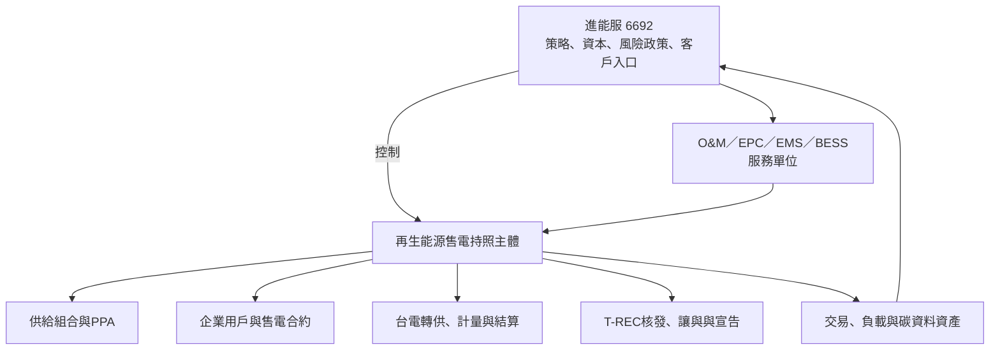
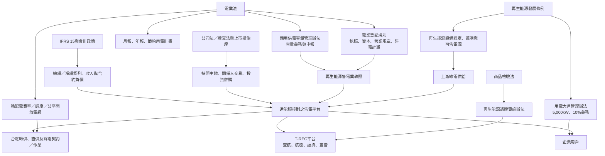
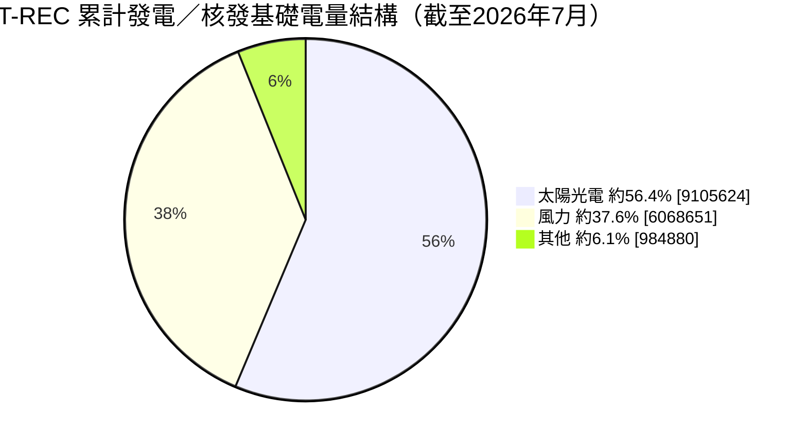
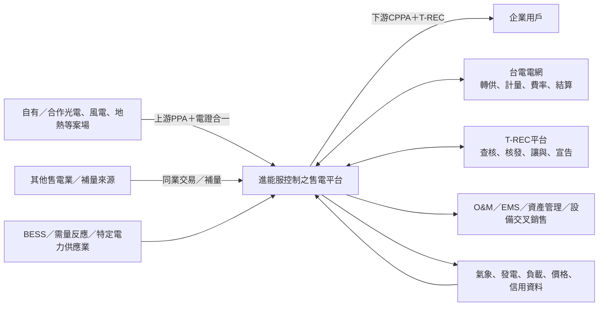

# 進能服（6692）進軍再生能源售電業  
## 董事會決策規劃報告

> **組織階層縱軸 × 價值鏈橫軸座標：** 董事會／董總 × 綠電供給組合、售電交易、轉供結算、能源資產管理  
> **決策層級：** 新事業進入、持照主體與公司治理、風險資本配置、營運模式  
> **查證基準日：** 2026 年 8 月 4 日  
> **事實標籤：** `【已查證】`＝法規或公開資料；`【管理建議】`＝本報告建議；`【待確認】`＝需法務、會計師、能源署、台電或內部資料確認  
> **法律聲明：** 本報告為事業規劃與決策支援，不取代律師法律意見、會計師會計判斷或主管機關個案核釋。

---

## 0. 董事會一頁決策

### 0.1 建議結論：有條件進入（Conditional GO）

**進能服應進入再生能源售電業，但不應定位為單純賺取每度價差的「綠電仲介商」，而應定位為「資產連結型售電與能源資產管理平台」。**

建議模式為：

1. **持照與控制權：** 由進能服直接控制的法人持有再生能源售電業執照；可以是進能服本體或 100%／具控制力之子公司。
2. **啟動期營運：** 前 12–18 個月採「核心能力自建＋後台作業代操」。
3. **第一期試點：** 年轉供量 30–60 GWh、1–2 家錨定用戶、3–5 組供給來源。
4. **收入定位：** 綠電價差只是第一層；第二層是交易／組合管理費，第三層是 O&M、EMS、BESS、特定電力供應業與資產管理交叉銷售。
5. **風險原則：** 未完成上、下游條款背靠背（back-to-back）、信用審查、備用容量與營運資金配置前，不簽具重大固定量或固定價風險的長約。

### 0.2 建議董事會本次通過的五項決議

| 決議 | 建議內容 | 董事會管控點 |
|---|---|---|
| 1. 進入方向 | 核准進入售電業之 Phase 0 與試點籌備，不等同一次核准全面承擔長期購售電曝險 | 每階段另設 Gate |
| 2. 持照路徑 | 優先採「進能服可控制之持照主體」；同步完成大自然能源電業之股權、控制權、既有契約與關係人交易 DD | 客戶、資料、合約與經濟利益不可落在不可控制主體 |
| 3. 試點上限 | 首期 30–60 GWh／年；單一買方不高於 40%，單一供給來源不高於 35% | 超限須重新報董事會或授權委員會 |
| 4. 代操模式 | 核准 12–18 個月混合代操；法遵責任、風險政策、定價、信用、合約與結算核准不得外包 | SLA、資料所有權與退出條款 |
| 5. 財務與風險 | 設定每度最低淨貢獻、兩個月採購流動性、DSO、信用限額、T-REC 零錯配等指標 | 每月風險報表、每季董事會檢討 |

### 0.3 三項否決條件

出現下列任一情況，應暫停進入或暫停簽約：

- **持照主體不可控制：** 進能服無法掌握客戶、交易資料、定價與現金流。
- **供需條款不對稱：** 上游固定收購、下游可任意減量；或下游保證供應、上游無補量責任。
- **現金流未封頂：** 未取得信用額度、保證金與付款條件安排，即承擔大量採購與逾期帳款風險。

---

## 1. Executive Summary

- **【已查證】法規進入門檻已降低，但營運門檻仍高。** 現行《電業登記規則》要求公司登記、營業規章、售電計畫及至少新台幣 500 萬元實收資本／自有資金財力證明；執照核發之官方完整案件處理期限為 2 個月。真正的障礙不在牌照，而在供給組合、台電轉供、T-REC、備用容量、信用與月結作業。[2][12]

- **【已查證】市場已具規模且快速擴張，但「持照家數」不等於有效競爭力。** 截至 2026 年 7 月 15 日，能源署公開名單列有 126 家再生能源售電業者；T-REC 平台顯示截至 2026 年 7 月，直供與轉供累計交易量為 14,457,207 MWh，T-REC 累計發電／核發基礎電量為 16,159,156 MWh。雙邊 PPA 價格與各業者實際市占並未充分公開，因此不可僅以牌照數推導市場份額。[10][11]

- **【已查證＋管理判斷】進能服比純交易新創更適合採「資產連結型售電」。** 公司公開資料揭露 348 座太陽光電系統、412 MW 累積建置量、1,626 GWh 累積發電量，並已取得特定電力供應業執照，具備 BESS、電力交易平台、投標優化與監控能力。這些能力可降低供給取得、案場資料、履約監控與交叉銷售成本。[13][14]

- **【管理建議】第一階段不追求營收規模，先驗證每度淨貢獻、現金循環與履約能力。** 以 30–60 GWh 試點，即使每度淨貢獻達 0.35 元，年貢獻約為 1,050–2,100 萬元，尚不足以單獨改變公司營收結構；其戰略價值在於建立可續約現金流、企業用戶入口、綠電資料資產，以及帶動 O&M／EMS／BESS／資產收購。

---

## 2. 三層解析：市場假設、公司主張、財務落點

### 2.1 第一層：市場假設是否成立

| 市場假設 | 查證結果 | 董事會解讀 |
|---|---|---|
| 企業綠電需求持續增加 | 5,000 kW 以上義務用戶須依前一年度平均契約容量 10% 履行再生能源義務；另有 RE100、供應鏈減碳與中小企業綠電商品需求 | 需求具有政策與供應鏈雙驅動，不完全依賴自願 ESG |
| 市場仍有進入空間 | 126 家列名，但公開資料無法證明皆有大量交易或穩定供給；價格與市占不透明 | 牌照本身不形成護城河；供給池、信用、結算與客戶組合才是 |
| 太陽光電可作為主供給 | T-REC 累計結構中太陽光電為最大宗；但日間出力與企業 24 小時負載不完全吻合 | 單靠光電會產生時段與形狀錯配，須搭配多電源、補量、BESS 或商品設計 |
| 售電可創造穩定收入 | 長期 PPA 可形成合約型收入，但每度價差可能薄，且占用營運資金 | 應看「淨貢獻＋現金轉換＋交叉銷售」，不能只看營收認列 |
| 新法提高市場流動性 | 現行《電業法》將再生能源售電業定義為購買再生能源發電設備生產之電能並予銷售，未再以售予終端用戶作為定義文字 | 可發展同業補量與供給組合；實務申報、契約與計量方式仍須個案確認 |

### 2.2 第二層：進能服的主張能否被可驗證指標支持

| 公司可主張能力 | 公開可驗證基礎 | 尚待內部驗證 |
|---|---|---|
| 光電案源與技術理解 | 348 座、412 MW 累積建置；具 O&M、監控與設計能力 | 可轉供且願意退出 FIT／簽 PPA 的可控案源量 |
| 電力交易與調度能力 | 已取得特定電力供應業執照，公開揭露電力交易、投標優化與即時監控能力 | 實際團隊人數、交易紀錄、系統 API、SLA 與損益 |
| 企業客戶開發能力 | 既有 EPC、模組、維運與工業客戶接觸面 | 具綠電預算與信用之錨定客戶名單、決策週期及合約量 |
| 未來基載供給 | 公司公開揭露地熱商轉後預計每年供電至少 9,000 萬度 | COD、P50/P90 發電量、資金到位、併網與可售電量；商轉前不得納入承諾供給 |
| 集團持照資源 | 能源署列有大自然能源電業，集團官網列為關係企業 | 6692 對其持股、實質控制、董事席次、既有義務與可移轉經濟利益 |

### 2.3 第三層：EPS、本業與現金流如何落地

進能服公開自結營收顯示，2024 年約 22.38 億元、2025 年約 14.63 億元，年減約 34.6%；此數據**不能直接證明本業惡化，也不能證明售電必然提高獲利**，但可說明工程型收入具有年度波動，建立合約型、可續約收入具有策略合理性。[15]

董事會應將售電業分成三種財務效果：

1. **本業營收效果：** 電力銷售可能形成較大營收，但須先由會計師依 IFRS 15 判斷進能服是主理人（principal）或代理人（agent），決定總額或淨額認列。
2. **本業毛利效果：** 每度毛利薄，任何輸配費、短缺補量、餘電、信用損失與代操費均可能吃掉價差。
3. **策略飛輪效果：** 售電客戶可導入光電建置、儲能、EMS、需量反應、維運與資產收購；這部分可能比純售電價差更具價值。

**董事會不應用「營收增加」作為單一成功指標；應以每度淨貢獻、營運資金、DSO、供需錯配、交叉銷售及合約集中度共同判斷。**

---

## 3. 策略定位：從工程專案走向「磐石 × 飛輪」

### 3.1 進能服既有磐石

- 太陽光電 EPC、設計、採購與工程管理
- O&M、雲端監控、發電績效與故障資料
- 模組代理、供應鏈與案場業主關係
- 特定電力供應業、BESS、交易平台與即時監控
- 未來地熱與其他可調度／較穩定電源布局

### 3.2 售電業形成的飛輪


### 3.3 不建議的定位

- 只做一次性 T-REC 撮合
- 長期依賴第三方牌照與白牌代售
- 未持有供給或客戶關係，只靠價格轉售
- 為追求營收而承擔無上限固定價、固定量與信用風險

---

## 4. 持照主體與進入路徑

### 4.1 四種選項比較

評分為本報告之管理判斷，5 分最佳。

| 選項 | 上市速度 | 控制權／資料 | 風險隔離 | 長期毛利與護城河 | 主要風險 | 建議 |
|---|---:|---:|---:|---:|---|---|
| A. 6692 本體申照 | 3 | 5 | 2 | 5 | 交易與信用風險直接進上市公司 | 可行，但不優先 |
| B. 6692 控制之 SPV 申照 | 3 | 5 | 5 | 5 | 需重新申照與建置營運體系 | **長期首選** |
| C. 投資／整合既有持照公司 | 4–5 | 取決於控制權 | 4 | 4–5 | 遺留契約、關係人、公允性與執照變更 | **條件式優先** |
| D. 白牌／全代操／仲介 | 5 | 1–2 | 4 | 1–2 | 客戶與資料外流、毛利薄、可替代性高 | 僅限短期學習 |

### 4.2 大自然能源電業之決策位置

【已查證】能源署名單將「大自然能源電業股份有限公司」列為第 22 家再生能源售電業；商工登記顯示實收資本額 5,352 萬元、營業項目含再生能源售電業。進金生國際官網將其列為「關係企業」，但公開資料不足以證明 6692 對其具控制力。[10][16][17]

因此不得直接以「集團已有牌照」取代治理判斷。董事會應先完成：

1. 股權結構、最終受益人及 6692 實質控制權。
2. 董事席次、重大事項否決權與管理權。
3. 既有上、下游 PPA、保證、訴訟、裁罰與信用曝險。
4. 客戶、供應商、交易資料、系統與智慧財產權所有權。
5. 與 6692 的關係人交易、訂價、公允性與移轉訂價安排。
6. 若投資、併購或變更執照，所需能源署、董事會、審計委員會及股東會程序。
7. 未來退出、股權買回、競業禁止與客戶不招攬安排。

### 4.3 建議目標架構



**治理原則：** 牌照可以放在 SPV，但風險政策、客戶資料、核心系統與經濟利益必須由 6692 控制。

---

## 5. 法規盤點與摘要

### 5.1 法規層級總圖



### 5.2 第一層：直接適用於售電業的核心法規

| 法規／規範 | 核心摘要 | 對進能服的直接要求 | 風險等級 |
|---|---|---|---|
| **《電業法》** | 再生能源售電業係購買再生能源發電設備生產之電能並予銷售；須取得執照後始得營業；電業原則上以股份有限公司為限；執照有效 20 年；須遵守轉供、備用容量、報表與節電計畫等義務 | 確立持照主體、交易範圍、台電電網使用、法定報告與責任 | 高 |
| **《電業登記規則》** | 申照需公司登記、營業規章、售電計畫（含購售電對象及數量預測）、至少 500 萬元實收資本／自有資金財力證明；執照期間須維持最低自有資金 | 申照文件不是形式文件，須能證明售電計畫具體可行 | 高 |
| **《備用供電容量管理辦法》** | 再生能源售電業備用容量＝基準年平均購電裝置容量 × 各電源比例；光電 3.3%、陸域風 6.7%、離岸風／小水力 10%、部分其他電源 15%；採基準年與第五年達成年機制 | 不是「售電度數 × 15%」；須建立容量台帳、逐年計畫與必要之容量採購契約 | 高 |
| **輸配電業費率與台電轉供規範** | 使用電網須依調度量、轉供量及年度費率繳費；2026 年再生能源直／轉供不排碳費率公開資訊為 0.3052 元／度，適用 2026/1/1–12/31 | 每年費率變動應有 change-in-law／pass-through 條款 | 高 |
| **電業簡明月報、年報及節約用電計畫** | 電業須按月編製簡明月報，年度終了後三個月內編年報並公開；售電業每年須提節約用電計畫 | 需有資料倉、法遵日曆、簽核與公開機制 | 中高 |

### 5.3 第二層：決定供給與企業需求的法規

| 法規／規範 | 核心摘要 | 對進能服的商業意義 |
|---|---|---|
| **《再生能源發展條例》** | 再生能源設備之電能可依直供、轉供、自用或售予電業等方式利用；並規範躉購制度及再生能源發展 | 上游供給需確認設備資格、是否受 FIT 契約拘束、可售電量及憑證權利 |
| **《再生能源發電設備設置管理辦法》** | 管理設備同意備案、設備登記、變更與認定 | 上游案場 DD 必須核對設備認定與登記狀態 |
| **《一定契約容量以上之電力用戶應設置再生能源發電設備管理辦法》** | 契約容量 5,000 kW 以上為義務用戶；義務裝置容量原則為前一年度平均契約容量 10%；可用設置、購買電力及憑證、儲能等方式履行 | 形成大型工業用戶穩定需求；應建立「義務履行＋供應鏈減碳」雙軌銷售 |
| **年度再生能源躉購費率與台電 FIT 契約／終止規則** | 既有 FIT 案場若轉做綠電 PPA，可能涉及終止契約、費用與轉供生效程序 | 不可把全部 O&M 案場視為可立即轉供；需逐案比較 FIT NPV 與 PPA NPV |
| **再生能源發電業申請直供審查規則** | 規範發電業直接設線供應用戶的資格與申請 | 進能服以轉供為主；特定鄰近大型用戶可另評估直供，但不是初期標準產品 |

### 5.4 第三層：T-REC、綠色宣告與資料治理

| 規範 | 核心摘要 | 進能服控制要求 |
|---|---|---|
| **《再生能源憑證實施辦法》** | 發電業、售電業或自用設備設置者可申請；FIT 與抵換專案原則排除；每累計 1,000 度核發 1 張電子憑證 | 電量、案場、憑證與客戶四本帳須一致 |
| **憑證讓與與宣告** | 轉供應讓與與轉供電量相符之憑證；原則上一張憑證讓與一次；使用或宣告後須登錄且不得再讓與 | T-REC 錯配或重複宣告採零容忍、雙人覆核 |
| **T-REC 平台作業** | 涉及帳號、查核、電量資料、讓與、使用與宣告 | 代操可執行，但帳號權限、最終核准與稽核軌跡須由持照主體控制 |
| **個資、資安與商業秘密** | 用戶電號、負載曲線、帳務、價格與碳資料均為敏感營運資料 | 契約須約定資料所有權、目的限制、資安事件通知、備份與退出移轉 |

### 5.5 上市櫃公司治理與會計

| 議題 | 董事會應要求 |
|---|---|
| 關係人交易 | 若使用大自然或其他關係企業，須檢視公允性、利益衝突、審計委員會與董事會程序 |
| 投資／併購 | 核對《電業法》電業併購同意、上市櫃取得或處分資產程序及執照換發 |
| 背書保證與資金貸與 | 不得以售電 SPV 為由形成無上限母公司信用支持 |
| IFRS 15 | 釐清 principal／agent、總額／淨額認列、變動對價、take-or-pay、保證金及合約負債 |
| 預期信用損失 | 建立客戶信用分級、額度、擔保、逾期停供／終止條款與 ECL 政策 |
| 內控與稽核 | 將定價、合約、轉供、憑證、結算、付款與報表納入內控制度 |

### 5.6 法規上的關鍵澄清

1. **最低 500 萬元不是完整進場資本。** 這是申照財力門檻；實際資本需求取決於月採購量、付款時差、保證金、信用支持與短缺補量。
2. **備用容量不是簡單按售電量乘 15%。** 再生能源售電業依法按基準年平均購電裝置容量及能源別比例計算，並採計畫與達成年機制。
3. **取得牌照不等於可以立即轉供。** 每一組案場、電號、用戶與轉供組合仍須完成台電契約、計量與 T-REC 作業。
4. **代操不移轉法定責任。** 法規未要求必須代操；即使委外，持照者仍須對申報、交易、電量、憑證與用戶責任負責。
5. **同業交易應做實務確認。** 現行定義已不以終端用戶為唯一銷售對象，可作為同業補量基礎；但正式商品上線前，應取得能源署／台電對契約、轉供與申報流程之書面或會議確認。

---

## 6. 台灣售電業市場情況

### 6.1 量化概況

| 指標 | 截止日期 | 公開數據 | 正確解讀 |
|---|---|---:|---|
| 再生能源售電業公開名單 | 2026-07-15 | 126 家 | 是列名家數，不代表 126 家均有活躍交易、相同信用或相同供給量 |
| 直供與轉供累計交易量 | 2026-07 | 14,457,207 MWh | 為 T-REC 平台累計資料，不等同 2026 單年售電市場營收 |
| T-REC 累計發電／核發基礎電量 | 2026-07 | 16,159,156 MWh | 反映憑證供給基礎；與可售長約量、剩餘量及即時交付量不同 |
| 2026 年 1–7 月 T-REC 發電量 | 2026-07 | 2,659,466 MWh | 可作近期供給活動指標，仍須拆分已交易／剩餘 |
| 2026 年綠電直／轉供不排碳費率 | 2026 全年 | 0.3052 元／度 | 年度受管制成本項目，不是完整到戶成本 |
| 台電短期小額綠電商品 | 2026 | 5.8／6.0／6.3 元／度等方案 | 是公開短期商品價格錨點，不可直接視為長期企業 PPA 市價 |

### 6.2 T-REC 累計供給結構

依 T-REC 平台公開累計數據，太陽光電約占 56.4%、風力約占 37.6%、其他約占 6.1%。此圖呈現的是**憑證發電／核發基礎結構，不是售電業市占或可交易庫存**。[11]



### 6.3 市場的六個結構性特徵

#### 1. 牌照碎片化，但有效競爭力可能集中

大量業者取得牌照，表示法規入口已普及；然而長約供給、企業信用、資金、結算系統與客戶信任不會平均分布。進能服不應以「第 127 家」思考，而應以「能控制多少可交付電量、多少企業負載與多少能源服務」思考。

#### 2. 雙邊協商為主，價格透明度低

企業 PPA 涉及年期、電源、時段、保證量、憑證、信用、提前終止與轉供費，公開價格很難直接比較。台電短期商品可提供價格錨點，但不能替代 10–20 年 CPPA 的估值。

#### 3. 太陽光電供給多，但「電量形狀」不是企業負載形狀

光電集中於日間，企業可能有夜間、假日或 24 小時負載。售電商需管理：

- 月度／年度發電偏差
- 日間與夜間時段錯配
- 天候、限電、停機與歲修
- 用戶產能變動與減量
- 餘電與短缺補量

#### 4. 需求從大型用戶向供應鏈與中小企業擴散

- 5,000 kW 以上義務用戶是政策型需求。
- 出口製造商受 RE100 客戶與範疇二盤查驅動。
- 中小企業透過可負擔綠電、RE30、短期商品等方案逐步進場。
- AIDC、半導體、電子、金屬、化工、運輸與大型商辦是高潛力客群，但信用、負載與年期差異大。

#### 5. 同業補量使市場由單線轉供走向組合管理

售電商之間可望形成補量、交換與供給池，但這也增加對標準化合約、信用限額、結算與交易系統的需求。進能服的特定電力供應業與 BESS 能力可成為差異化，而非獨立事業。

#### 6. 現金流比會計毛利更容易成為失敗原因

上游發電業者通常要求較快付款；大型企業可能採月結 30–60 天，另有保證金、台電費用與短缺補量。即使帳面每度有價差，也可能因 DSO 與採購付款時差而消耗大量流動性。

### 6.4 客群優先順序

| 優先級 | 客群 | 痛點 | 進能服切入方案 |
|---|---|---|---|
| P1 | 既有 EPC／O&M 工業客戶、5,000 kW 以上義務用戶 | 法定義務、供應鏈要求、缺乏可稽核綠電 | 綠電 PPA＋T-REC＋EMS／儲能 |
| P1 | 具穩定負載與良好信用之電子、金屬、製造客戶 | 長期綠電缺口、價格與供給不確定 | 多案場組合、保證量分級、短缺機制 |
| P2 | 園區、商辦、連鎖通路與中型工廠 | 單戶需求較小、採購能力不足 | 聚合型商品、標準化合約、年度方案 |
| P2 | 再生能源案場業主 | FIT 轉 PPA 評估、餘電、憑證與長約 | FIT／PPA NPV 比較＋O&M＋售電 |
| P3 | 高波動、低信用或短期需求客戶 | 量小、流失率高、帳款風險高 | 僅提供預付／保證金／平台型商品 |

### 6.5 市場吸引力評分

| 構面 | 評分（5分制） | 判斷 |
|---|---:|---|
| 需求成長 | 4.0 | 法規、RE100、供應鏈與淨零推動 |
| 牌照進入障礙 | 2.0 | 門檻降低，牌照不稀缺 |
| 營運與資料障礙 | 4.5 | 台電、T-REC、計量、結算、備用容量與報表複雜 |
| 單純價差毛利 | 2.0–3.0 | 易受競爭、年度費率與供需偏差侵蝕 |
| 進能服策略適配 | 4.0–4.5 | EPC、O&M、BESS、交易與未來基載可形成差異 |
| 整體建議 | **有條件進入** | 必須採資產連結與風險受控模式 |

---

## 7. 商業模式架構

### 7.1 交易與價值流



### 7.2 四層收入

| 層級 | 收入來源 | 毛利特性 | 進能服優勢 |
|---|---|---|---|
| L1 電能與憑證價差 | 下游售價－上游採購與受管制費用 | 薄、量大、易受偏差侵蝕 | 案源與客戶入口 |
| L2 組合／交易管理費 | 供給池、補量、T-REC、結算、報表 | 較穩定，可採固定月費＋度數費 | 特定電力供應業與監控 |
| L3 能源服務 | EMS、BESS、需量反應、節能與碳資料 | 專案＋續約型，毛利較高 | 工程與系統整合 |
| L4 資產管理與投資 | O&M、績效分成、整新、收購與資產管理費 | 可形成長期飛輪 | 412 MW 建置與維運經驗 |

### 7.3 建議產品包

#### 產品 A：Green Transfer Basic

- 電證合一轉供
- 固定年度量或區間量
- T-REC 讓與與宣告協助
- 適用：初次採購綠電之義務用戶

#### 產品 B：Green Portfolio Manager

- 多案場、多電源與補量
- 月度供需預測、偏差管理
- 定期綠電、碳與憑證報表
- 適用：RE100、跨廠區或用電量大客戶

#### 產品 C：Green Power + Flexibility

- PPA＋BESS／EMS／需量反應
- 需量、尖峰、備援與綠電整合
- 適用：高壓／特高壓、24 小時負載、微電網或 AIDC

#### 產品 D：Asset-to-PPA

- 為案場業主評估 FIT 終止、PPA NPV、餘電與憑證
- 搭配 O&M、整新、融資或資產收購
- 適用：進能服既有 O&M／EPC 案場與外部資產持有人

### 7.4 單位經濟公式

```text
每度淨貢獻
＝ 下游售價
－ 上游電證合一採購成本
－ 台電輸配／調度與年度費率
－ 備用供電容量成本
－ 代操、T-REC、計量與結算成本
－ 餘電處理與短缺補量損失
－ 信用損失與融資成本
－ 其他變動營運成本
```

**管理要求：** 業務報價必須從「每度淨貢獻」回推，不得只看買賣價差。

### 7.5 試點貢獻敏感度

下表為**管理情境假設，不是市場報價**；單位為新台幣百萬元／年，且尚未扣除固定人事、法務、系統、稅與總部費用。

| 年轉供量 | 淨貢獻 0.20 元／度 | 淨貢獻 0.35 元／度 | 淨貢獻 0.50 元／度 |
|---:|---:|---:|---:|
| 30 GWh | 6.0 | 10.5 | 15.0 |
| 60 GWh | 12.0 | 21.0 | 30.0 |
| 100 GWh | 20.0 | 35.0 | 50.0 |

**董事會含意：**

- 30–60 GWh 是營運驗證規模，不是獲利規模。
- 若無 L2–L4 服務收入，純 L1 價差不一定足以支撐完整團隊與風險資本。
- 商業模式應要求售電客戶之 O&M／EMS／BESS／顧問交叉銷售率，而非只追求轉供度數。

### 7.6 營運資金公式

```text
營運資金需求
≈ 每月採購電量 × 上游單價 ×（上游付款與下游客戶收款天數差 ÷ 30）
＋ 台電／交易／履約保證金
＋ 短缺補量與價格波動緩衝
－ 客戶預收款或保證金
```

**管理建議：** 可用流動性與已承諾信用額度至少覆蓋兩個月採購現金需求；單一客戶逾期不得以擴量掩蓋。

---

## 8. 營運架構

### 8.1 端到端流程


### 8.2 建議組織：5–7 FTE 核心團隊

| 角色 | 核心責任 | 初期配置 |
|---|---|---|
| 售電事業負責人／P&L Owner | 策略、損益、風險、董事會報告 | 1 |
| 供給開發與組合管理 | 上游 PPA、發電預測、補量與供給集中度 | 1–2 |
| 企業客戶與產品 | 負載分析、CPPA、價格、續約與交叉銷售 | 1–2 |
| 法務、合約與法遵 | 牌照、營業規章、契約、關係人與申報 | 1，可共用 |
| 結算、資料與 T-REC | 台電電量、T-REC、對帳、開票與報表 | 1–2 |
| 財務、信用與資金 | 信用額度、保證金、DSO、ECL、流動性 | 1，可共用 |
| EMS／BESS／產品 PM | 彈性資源與能源服務整合 | 0.5–1，可共用 |

### 8.3 RACI

`A`＝最終負責、`R`＝執行、`C`＝諮詢、`I`＝知會。

| 作業 | 董總／風委會 | 售電P&L | 業務 | 供給組合 | 法務法遵 | 財務信用 | 結算資料 | 代操商 |
|---|---|---|---|---|---|---|---|---|
| 年度風險政策 | A | R | I | C | C | C | I | I |
| 上游供給採購 | I | A | C | R | C | C | I | I |
| 下游客戶與定價 | I | A | R | C | C | C | I | I |
| 信用額度 | I | C | C | I | C | A/R | I | I |
| 合約核准 | I | C | C | C | A/R | C | I | I |
| 台電轉供申請 | I | A | C | C | C | I | R | R |
| T-REC 作業 | I | A | I | C | C | I | R | R |
| 月度對帳與開票 | I | A | I | C | I | C | R | R |
| 付款與收款核准 | I | C | I | I | I | A/R | C | I |
| 法定申報 | I | A | I | C | R | C | R | C |
| 異常／事件處理 | A | R | C | C | C | C | C | C |

---

## 9. （A）到底需要簽幾份合約？

### 9.1 董事會答案

**單一發電案場 × 單一企業用戶的簡化試點：**

- **3 份核心契約類別**
- **另加 2–4 組申請、授權、備援或代操文件**
- **實務上約 5–7 組文件／契約組**

但數量不是固定值；同一案場多電號、多用戶、多廠區或多售電業補量時，台電契約與附件會成倍增加。

### 9.2 核心契約矩陣

| # | 文件／契約 | 當事人 | 必要性 | 主要條款 |
|---:|---|---|---|---|
| 1 | **上游再生能源電力暨憑證購售契約（Upstream PPA）** | 持照售電主體 ↔ 發電業／自用設備設置者 | 核心必須 | COD、可售資格、電量、價格、年期、P50/P90、短缺、餘電、限電、停機、T-REC、信用、提前終止、change-in-law |
| 2 | **下游綠電售電契約／企業 PPA（CPPA）** | 持照售電主體 ↔ 企業用戶 | 核心必須 | 保證量／區間量、價格、轉供費、T-REC、綠色宣告、減量、違約、信用、付款、提前終止 |
| 3 | **台電轉供契約及相關契約組** | 發電端／售電業／用戶 ↔ 台電 | 核心必須 | 轉供組合、電號、計量、起始日、費率、調度、資料與結算；數量依案場與用戶組合 |
| 4 | **T-REC 平台申請、授權、讓與與宣告文件** | 發電端、售電業、用戶、T-REC 中心 | 作業必要 | 帳號、查核、電量、讓與、宣告、權限與稽核 |
| 5 | **備用供電容量採購契約或條款** | 售電業 ↔ 合格容量提供者 | 條件式必要 | 容量、可用性、調度性、達成年、證明文件、違約 |
| 6 | **餘電／FIT 終止與轉換文件** | 案場業主 ↔ 台電／售電業 | 視案場而定 | 終止費、轉供生效、餘電去向、原契約權利義務 |
| 7 | **營運代操／系統服務契約** | 持照售電主體 ↔ 代操商 | 採代操時必要 | SLA、資料、帳號、資安、責任、賠償、稽核、退出與移轉 |
| 8 | **信用支持文件** | 客戶／發電業／金融機構 ↔ 售電主體 | 依信用而定 | 保證金、保函、母公司保證、信用觸發、額度與補件 |

### 9.3 組合化後的契約公式

```text
總契約／文件組
＝ N 份上游 PPA
＋ M 份下游 CPPA
＋ K 組台電轉供契約與附件
＋ 1 組代操／系統服務契約
＋ 視需要之備用容量、餘電、FIT轉換與信用支持文件
```

### 9.4 合約條款必須背靠背的八個項目

| 項目 | 上游與下游應如何對齊 |
|---|---|
| 電量 | 保證量、容許偏差與減量權一致 |
| 年期 | 上游不應長於已鎖定下游年期，除非有再銷售能力 |
| 價格 | 固定／浮動、CPI、年度費率與法規變更可傳導 |
| 短缺 | 上游短缺責任要能覆蓋下游補量或賠償 |
| 餘電 | 明定售回、轉售、同業交易或由案場承擔 |
| T-REC | 產生、所有權、讓與、宣告與替代憑證一致 |
| 信用 | 上游付款與下游收款條件需降低資金缺口 |
| 終止 | COD 延遲、違約、信用惡化與法規變更權利對稱 |

---

## 10. （B）是否需要代操？

### 10.1 法規答案

**不需要。** 法規未要求再生能源售電業必須由第三方代操。

**但不可因委外而移轉持照者責任。** 月報、年報、節電計畫、電量、T-REC、用戶、備用容量與交易責任，最終仍由持照主體承擔。

### 10.2 商業答案

**啟動期建議需要「部分代操」，不建議「全代操」。**

理由：

- 初期量小，自建完整 24×7／月結後台不具成本效益。
- 台電轉供、T-REC、電量對帳與申報有專業學習曲線。
- 進能服仍須保留風險、定價、信用、客戶與資料能力，否則無法形成護城河。

### 10.3 建議委外與自建邊界

| 初期可委外 | 必須保留在進能服／持照主體 |
|---|---|
| 台電轉供文件製作與進度追蹤 | 牌照與法定責任 |
| T-REC 日常帳務、讓與操作與資料整理 | T-REC 最終核准、綠色宣告與稽核 |
| 電表資料蒐集與月度對帳 | 供給策略、採購與補量決策 |
| 帳單計算與開票資料產出 | 定價、毛利底線與風險限額 |
| 發電／負載預測之技術運算 | 客戶信用、保證與停供／終止決策 |
| 法定報表初稿與平台作業 | 合約所有權、法務簽核與主管機關溝通 |
| 異常監控與工單 | 結算與付款最終核准 |
| 系統維運 | 客戶關係、資料所有權與產品設計 |

### 10.4 代操商 SLA

| 指標 | 建議最低標準 |
|---|---:|
| 轉供／資料處理成功率 | ≥ 99.5% |
| 帳單計算正確率 | ≥ 99.9% |
| T-REC 錯配／重複宣告 | 0 |
| 計量資料完整率 | ≥ 99.5% |
| 月結完成 | D+5；最遲 D+7 |
| 重大異常通知 | 1 小時內 |
| 一般事件回應 | 4 個工作小時內 |
| 稽核軌跡 | 100% 可追溯 |
| 退出資料移轉 | 30–60 日內完成、格式預先約定 |

### 10.5 內製觸發條件

達下列任兩項，應評估把結算、組合管理或 T-REC 作業內製：

- 年轉供量達 50–100 GWh。
- 活躍上、下游交易對手合計達 8–12 家。
- 供給來源跨多電源、多售電業、BESS 或地熱。
- 代操費已高於新增 2–3 名內部人力與系統成本。
- 代操商造成報價延遲、資料鎖定或客戶體驗問題。
- 進能服希望把交易與負載資料發展成 EMS／資產管理產品。

---

## 11. 分階段落地計畫

### Phase 0：治理與可行性（0–3 個月）

**目的：** 決定持照主體與是否值得進入。

- 完成大自然及其他持照路徑之法律、財務、稅務、營運 DD。
- 盤點進能服可控制／可合作之案場：設備資格、FIT、發電量、P90、電號、T-REC、業主意願。
- 建立 10–20 家目標客戶清單，取得 1–2 家錨定用戶 LOI 或具體需求。
- 完成單位經濟模型、信用政策、風險政策與會計 memo。
- 啟動代操商／系統商 RFP。
- 與能源署、台電及 T-REC 中心確認同業交易、申照、轉供與資料作業。

**Gate 0：**

- 至少 30 GWh 可交付供給管線。
- 至少 1 家具信用之錨定客戶。
- 中位情境淨貢獻符合董事會底線。
- 持照主體控制權與治理無重大疑慮。

### Phase 1：申照與建置（3–6 個月）

- 完成公司、營業規章、售電計畫與財力文件。
- 申請或整合持照主體；官方完整案件處理期限為 2 個月，**4–6 個月為含文件準備、補件、台電及 T-REC 作業之管理估計**。
- 定稿上游 PPA、下游 CPPA、代操、信用支持與內控文件。
- 建置供給、客戶、電號、價格、T-REC、結算與風險台帳。
- 完成第一組轉供申請與平行測試。

**Gate 1：**

- 牌照與平台權限完成。
- 上、下游契約已背靠背。
- 台電、T-REC、開票與付款流程全流程演練通過。
- 信用與流動性到位。

### Phase 2：受控試點（6–18 個月）

- 年化 30–60 GWh。
- 3–5 組供給來源、1–2 家錨定用戶。
- 月度 P&L、現金流、偏差、T-REC 與 SLA 報表。
- 導入 EMS、BESS、O&M 至至少一個售電客戶。
- 依交易量逐步內製組合管理與結算。

**Gate 2：**

- 連續 6 個月每度淨貢獻為正且達底線。
- 無重大 T-REC、轉供、法遵或信用事件。
- DSO、集中度與流動性均在政策內。
- 交叉銷售形成可驗證收入。

### Phase 3：規模化（18–36 個月）

- 年轉供量達 100 GWh 以上。
- 擴展多電源、同業補量、地熱、BESS 與彈性商品。
- 建立自有交易／結算／能源資料平台。
- 發展區域型或產業型綠電組合、園區與 AIDC 產品。
- 評估資產管理基金、SPV 收購與綠電長約聯動。

---

## 12. 董事會 KPI 與風險限額

以下均為管理建議，須依實際報價、資金成本與董事會風險偏好核定。

### 12.1 商業 KPI

| KPI | 試點目標 |
|---|---:|
| 年化已轉供量 | 30–60 GWh |
| 已簽約供給／已簽約銷售 | ≥ 1.10 倍；以 P90 可交付量檢視 |
| 單一供給來源占比 | ≤ 35% |
| 單一買方占比 | ≤ 40% |
| 加權平均剩餘合約年期 | 至少覆蓋投資與固定成本回收期 |
| 客戶續約／擴量率 | 建立 12 個月後基準 |
| 售電客戶交叉銷售率 | 至少 30% 有 O&M／EMS／BESS 商機 |

### 12.2 財務與現金 KPI

| KPI | 試點目標 |
|---|---:|
| 每度淨貢獻 | 高於董事會核定底線；0.35 元／度僅作本報告中位敏感度 |
| DSO | ≤ 45 天 |
| 上下游付款天數缺口 | 原則 ≤ 30 天 |
| 可用流動性／信用額度 | ≥ 2 個月採購現金需求 |
| 逾期 60 天帳款 | 原則為 0；超限停止擴量 |
| 信用損失率 | 低於董事會核定上限 |
| 月結關帳 | D+5，最遲 D+7 |

### 12.3 營運與法遵 KPI

| KPI | 目標 |
|---|---:|
| 轉供與計量資料成功率 | ≥ 99.5% |
| 帳單正確率 | ≥ 99.9% |
| T-REC 電量錯配 | 0 |
| 重複讓與／重複宣告 | 0 |
| 法定申報逾期 | 0 |
| 重大資安事件 | 0 |
| 未經授權超限交易 | 0 |

---

## 13. 風險登錄表

| 風險 | 機率／影響 | 早期警訊 | 管控措施 | Owner |
|---|---|---|---|---|
| 發電短缺、天候與停機 | 中／高 | P90 下降、PR 異常、工單增加 | 多案場、多電源；短缺條款；替代供給；O&M 即時監控 | 供給組合 |
| 時段／形狀錯配 | 高／中高 | 日間餘電、夜間缺口擴大 | 商品分時設計、補量、BESS、用戶組合 | 組合管理 |
| 固定價風險 | 中／高 | 供給成本或受管制費上升 | 年度調價、指數化、change-in-law、價差限額 | P&L／財務 |
| 客戶信用與逾期 | 中／高 | DSO 上升、評等下降 | 保證金、保函、額度、停供／終止、ECL | 財務信用 |
| 上游業主違約 | 中／高 | COD 延遲、產權或融資異常 | DD、履約保證、step-in、替代供給 | 供給／法務 |
| T-REC 錯配或重複宣告 | 低／極高 | 台帳差異、權限異常 | 單一憑證台帳、雙人覆核、權限分離、稽核 | 結算／法遵 |
| 台電轉供延遲 | 中／中高 | 補件、電表或契約卡關 | 里程碑、前置審查、延遲生效條款 | 結算／代操 |
| 年度費率與法規變更 | 中／中 | 費率審議、修法草案 | pass-through、重談權、監管雷達 | 法務／P&L |
| 營運資金缺口 | 中／極高 | 付款缺口擴大、額度使用率高 | 兩月流動性、預收／保證金、交易上限 | CFO |
| 關係人治理 | 中／高 | 權利義務不清、價格不可比較 | 獨立估值、審計委員會、移轉訂價、資料／客戶權利 | 董事會／法務 |
| 代操商鎖定 | 中／中高 | API 不開放、資料不可匯出 | 資料所有權、介面標準、退出移轉、備援商 | IT／P&L |
| 收入認列錯誤 | 中／高 | 毛額／淨額判斷不一致 | IFRS 15 memo、會計師預審、合約標準化 | CFO |
| 地熱開發延遲 | 中高／高 | 鑽探、融資、併網延遲 | 商轉前不納入保證供給；分階段採購 | 投資／供給 |
| 綠色宣告與聲譽 | 低中／極高 | 客戶宣告與憑證不一致 | 宣告規範、客戶教育、審核權與追溯 | 法遵／業務 |
| 資安與客戶資料 | 中／高 | 帳號異常、資料外洩 | MFA、最小權限、SOC、備份、事件通報 | IT／法遵 |

---

## 14. 董事會決議草案

> **案由：** 擬進入再生能源售電業並辦理第一階段治理、申照及試點準備案。

### 建議決議文字

1. 原則同意公司以「資產連結型售電與能源資產管理平台」為定位，推進再生能源售電事業。
2. 授權經營團隊於 3 個月內完成持照主體方案、大自然能源電業之股權與營運 DD、法務及會計意見、供需管線、代操商 RFP、風險政策及試點損益模型。
3. 持照主體須由進能服直接或間接控制；若採關係企業合作而未具控制權，僅得作過渡性合作，且客戶、資料、合約與定價不得不可逆移轉。
4. 第一階段商轉上限為年化 30–60 GWh、1–2 家錨定用戶、3–5 組供給來源；任何超過董事會核定之交易量、年期、固定價、集中度、信用或流動性上限者，應另案核准。
5. 同意啟動期採 12–18 個月混合代操；持照責任、定價、信用、合約、結算核准、客戶關係、資料所有權與法遵責任不得外包。
6. 經營團隊須於 Gate 0 與 Gate 1 分別回報董事會；未達 Gate 條件不得簽署重大長期購售電契約。
7. 財務單位應於正式簽約前取得會計師對 IFRS 15 主理人／代理人及總額／淨額認列之書面評估；法務單位應完成關係人交易、電業許可、備用容量、台電與 T-REC 作業之法律檢核。
8. 內部稽核應將定價、信用、契約、轉供、T-REC、結算、付款與法定申報納入稽核計畫。

---

## 15. Phase 0 DD 清單

### 15.1 持照主體

- [ ] 牌照有效性、有效期限、變更紀錄與裁罰
- [ ] 公司股權、實質控制、董事與經理人
- [ ] 資本、自有資金與持續維持要求
- [ ] 既有售電計畫、營業規章與申報情況
- [ ] 既有上游、下游、台電與 T-REC 契約
- [ ] 訴訟、保證、關係人往來與或有負債
- [ ] 系統、帳號、資料與智慧財產權
- [ ] 客戶、供應商及員工留任／移轉
- [ ] 併購、投資與執照換發程序

### 15.2 上游供給

- [ ] 設備認定、發電業／自用設備資格
- [ ] FIT 契約、終止費及轉供可行性
- [ ] 最近 24–36 個月發電量、PR、可用率、P50／P90
- [ ] 電號、併網點、轉供限制、電表與資料權限
- [ ] T-REC 查核、已核發、已讓與、已宣告與剩餘
- [ ] 土地、屋頂、租約、融資與擔保權
- [ ] O&M、保險、設備保固與停機風險
- [ ] 業主信用、履約保證與 step-in 權利

### 15.3 下游客戶

- [ ] 各廠區 24 個月負載與電費資料
- [ ] 綠電目標、用電大戶義務、RE100／供應鏈要求
- [ ] 年度、月度、時段需求與容許偏差
- [ ] 信用評等、財報、付款政策與保證能力
- [ ] 需求減量、停工、遷廠與提前終止風險
- [ ] 綠色宣告、T-REC 使用與稽核需求
- [ ] EMS、BESS、O&M 或其他交叉銷售機會

### 15.4 營運與系統

- [ ] 台電轉供流程與案件處理時程
- [ ] T-REC 權限、查核、讓與與宣告流程
- [ ] 發電與負載預測
- [ ] 電量、價格、費率、憑證與帳單的單一資料模型
- [ ] 開票、收款、付款、總帳與 ECL
- [ ] 法定月報、年報、節約用電計畫與備用容量申報
- [ ] 資安、權限、備份、稽核軌跡與災難復原
- [ ] 代操 SLA、API、資料匯出與退出計畫

---

## 16. 尚待董事會／經營團隊回答的問題

1. **進能服希望售電業的主要目的為何？** 純收益、客戶入口、案場去化、資產管理，或支援地熱／BESS？不同目的會改變持照主體與風險偏好。
2. **可控制供給量有多少？** 需把 412 MW 建置實績與「可轉供、可簽長約、可取得 T-REC」的供給量切開。
3. **大自然是否可由 6692 控制？** 若不能，應把它視為第三方，而非內部資源。
4. **董事會可接受多少價格、電量、信用與流動性曝險？**
5. **售電與特定電力供應業是否共用同一資料與交易平台？**
6. **地熱供給何時可納入 firm supply？** 在 COD 與可驗證 P90 前，不應向企業用戶保證。
7. **會計認列如何影響市場溝通？** 若採淨額認列，營收不大但貢獻可穩定；若採總額認列，營收放大但毛利率可能下降。

---

## 17. 事實審查、限制與信心水準

### 17.1 可高度信賴

- 現行法律條文、修正日期與申照文件。
- 能源署公開之售電業名單與更新日期。
- T-REC 平台公開之累計電量。
- 進能服官網公開之建置量、累積發電量與特定電力供應業能力。
- 大自然之公司登記與能源署列名。

### 17.2 必須謹慎解讀

- 126 家不等於 126 家活躍或具有相同市占。
- T-REC 累計發電量不等於可立即簽約供給，也不等於售電市場年度營收。
- 台電短期綠電商品價格不可直接作為長期 PPA 價格。
- 2024–2025 營收變化不可直接歸因於售電業機會或本業問題。
- 進能服官網揭露的地熱年供電量屬未來預計值，非已商轉實績。

### 17.3 待主管機關或專業顧問確認

- 同業交易在特定商品、電號與轉供組合下的申報與契約實務。
- 備用容量義務之公司個案通知、達成年及可採容量來源。
- 使用既有持照公司之投資、併購、換照及關係人程序。
- IFRS 15 總額／淨額、變動對價與保證量之會計處理。
- 特定 FIT 案場終止費、轉供起始與憑證權利。

### 17.4 整體信心評估

**結論信心：中高。**  
「進能服適合進入，但應採可控制持照主體、資產連結、混合代操與分階段 Gate」之方向，有法規、市場與公司能力支持；實際投資額、每度底價、供給量與獲利仍須由內部 DD、正式報價及主管機關確認後核定。

---

## 18. 主要資料來源

> 以下以官方法規、主管機關、台電、T-REC 與公司公開資料為主；價格新聞僅作輔助。

1. **《電業法》**，全國法規資料庫，修正日期 2026-01-05  
   https://law.moj.gov.tw/LawClass/LawAll.aspx?pcode=J0030011

2. **《電業登記規則》**，全國法規資料庫，修正日期 2025-09-24  
   https://law.moj.gov.tw/LawClass/LawAll.aspx?pcode=J0030012

3. **《備用供電容量管理辦法》**，經濟部主管法規共用系統，修正日期 2025-01-08  
   https://law.moea.gov.tw/LawContent.aspx?id=GL000343

4. **《再生能源發展條例》**，全國法規資料庫，修正日期 2025-06-11  
   https://law.moj.gov.tw/LawClass/LawAll.aspx?pcode=J0130032

5. **《一定契約容量以上之電力用戶應設置再生能源發電設備管理辦法》**  
   https://law.moea.gov.tw/LawContent.aspx?id=GL001116

6. **《再生能源憑證實施辦法》**，修正日期 2025-05-26  
   https://law.moea.gov.tw/LawContent.aspx?id=GL000262

7. **《再生能源發電設備設置管理辦法》**，修正日期 2026-03-11  
   https://law.moea.gov.tw/LawContent.aspx?id=FL054000

8. **台電：電能轉供及併網型直供契約與作業**  
   https://hc2.taipower.com.tw/2289/2323/2337/58921/normalPost

9. **台電：再生能源電能購售契約終止作業注意事項**  
   https://hc1.taipower.com.tw/2289/2484/51434/62385/normalPost

10. **經濟部能源署：再生能源售電業基本資料**，更新日期 2026-07-15  
    https://www.moeaea.gov.tw/ecw/populace/content/Content.aspx?menu_id=8887

11. **國家再生能源憑證中心 T-REC：核發與直供／轉供交易資料**，截至 2026-07  
    https://www.trec.org.tw/en/transaction_history  
    https://www.trec.org.tw/en/transaction_history_direct?year=2026

12. **經濟部能源署：再生能源售電業執照核發、換發之人民申請案處理期限**  
    https://www.moeaea.gov.tw/ECW/populace/content/Content.aspx?menu_id=26480

13. **進金生能源服務：公司首頁與建置實績**  
    https://acmepointes.com/

14. **進金生能源服務：特定電力供應業**  
    https://acmepointes.com/sese/

15. **進金生能源服務：每月自結營收**  
    https://acmepointes.com/revenue/

16. **經濟部商工登記：大自然能源電業股份有限公司**  
    https://findbiz.nat.gov.tw/fts/company/90492982

17. **進金生國際：關係企業與歷史沿革**  
    https://acmepoint.com/about-us/

18. **2026 年輸配電業費率之公開報導（引述經濟部電價費率審議結果）**  
    https://www.cna.com.tw/news/aie/202512030388.aspx

19. **台電 RE30 電力商品說明**  
    https://service.taipower.com.tw/tpcjournal/article/7945

20. **經濟部：2026 年台電小額綠電商品與價格**  
    https://service.moea.gov.tw/EE514/tw/geipc/155-7224.html

---

# 往上往下

**往上：董事會要決定的不是「要不要多一張售電牌照」，而是是否要把進能服從工程承攬商推進為能控制客戶、供給、資料與現金流的能源服務平台。**

**往下：經營團隊下一步不是立即簽長約，而是在 90 天內交付四項可驗證成果：持照控制方案、30 GWh 以上可交付供給、至少一家錨定客戶、以及含信用與營運資金的完整每度淨貢獻模型。**
