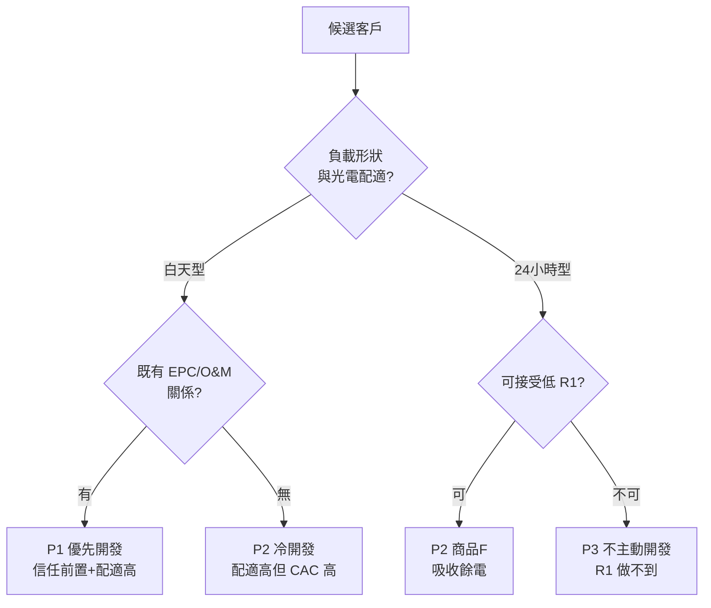

# 進能服（6692）進軍再生能源售電業
## 董事會決策規劃報告　第三版

> **座標：** 2.1 董事會 × 1.2 五年計畫 × 6 場域經濟（新事業進入）／執行面落在 4.1 業務開發 × 3.5 財務 × 1.3 合作夥伴
> **查證基準日：** 2026 年 8 月 4 日
> **事實標籤：** `【已查證】`＝法規或公開資料；`【會議輸入】`＝2026-02-13 POXA 會議記錄之揭露，屬第一手產業資訊但非公開查證；`【管理推估】`＝本報告以假設參數計算，非市場報價；`【待確認】`＝需法務、會計師、能源署、台電、POXA 或內部資料確認
> **法律聲明：** 本報告為事業規劃與決策支援，不取代律師法律意見、會計師會計判斷或主管機關個案核釋。

---

## 0. 本版與 v2 的差異（請先讀這一頁）

v3 的主要輸入是 2026-02-13 與 POXA 的會議記錄。這份記錄補上了 v1、v2 都缺的**產業實務層**，並揭露一項制度變革（彈性分配）——**v1 與 v2 完全漏掉，而它直接惡化單位經濟**。

| 項目 | v2 | v3 | 改動原因 |
|---|---|---|---|
| 轉供制度 | 未區分，隱含一般轉供 | **新增彈性分配專章（§3），試點採雙軌並行、依客戶分流** | 【會議輸入】彈性分配取消二次匹配，純光電之 R1 下滑、餘電增加 |
| 客戶篩選 | 僅「關係維度」（既有 O&M 客戶優先） | **新增「負載形狀維度」篩選矩陣（§4）** | 【會議輸入】百貨與光電配適度高、24 小時工廠低；條款同質化「湊在一起只會死得更快」 |
| 每度淨貢獻 | 中位 0.03 元 | **雙軌加權後中位 0.11 元（§5）** | 彈性分配拉低、餘電聚合拉高，兩股力道抵銷後略優於 v2 |
| 供給來源 | 僅一般 PPA（10–30 MW 可控） | **新增餘電聚合為輔助供給（§6）** | 【會議輸入】300+ 光電客戶自發自用後餘電，台電僅收 3.6 元 |
| 合作夥伴 | 未列 | **新增 POXA 合作架構專章（§7），共同開發綠電銷售雲平台** | 董事會確認之合作定位 |
| 系統策略 | 泛稱「代操」 | **拆為三塊：匹配試算（POXA）／帳務結算（ERP＋外部）／T-REC（自理）** | 【會議輸入】POXA 明確排除帳務，且無發電端能力 |
| 市場判讀 | 待查證 | **新增台積電採購瓶頸之結構含意（§8）** | 【會議輸入】台積電已達瓶頸，售電業開始出現餘電 |
| 大自然能源 | 一般交易對手 | **維持，並新增會議記錄之口徑更正要求（§9）** | 董事會再次確認無關；但會議記錄中有相反陳述，須統一對外口徑 |
| 財務結論 | 中位年虧 610–640 萬 | **年虧 465 萬（僅訂閱）／598 萬（含平台共同開發）（§5.3）** | 供給組合改善但平台開發增加固定成本 |
| **預算可行性** | 緩衝 372 萬（14%） | **加入平台後超支 58 萬，須同時砍平台至 400 萬並下修規模至 15–20 GWh，緩衝始回到 192 萬（6.4%）（§5.4）** | **v3 試算才發現的硬約束** |

**結論方向不變：以客戶入口為目的、預算封頂、輕量進入。但 v3 新增一個 v2 沒有的產出——共同開發的平台能力本身可能是資產，不只是成本。**

---

## 1. 董事會一頁決策

### 1.1 建議結論：封頂進入，雙軌商品，平台共建（Capped GO with Platform）

**進能服應取得再生能源售電業執照，定位為企業客戶入口；並與 POXA 共同開發綠電銷售雲平台，把匹配與試算的複雜度外部化，換取 2–3 人編制下經營雙軌商品的能力。**

四個必須同時接受的推論：

1. **L1 電能價差在試點期預期為虧損，這是通路取得成本。** 雙軌加權中位情境年虧 465–632 萬。
2. **KPI 主軸為「錨定客戶家數」與「每家客戶取得成本」，不是轉供度數。**
3. **三年累計投入以 3,000 萬封頂——但 v3 試算後發現「完整試點 ＋ 平台共建」兩件事同時做會超支 58 萬（§5.4）。** 建議同時採取「平台共建降至 400 萬」與「試點規模下修至 15–20 GWh」，緩衝始能回到 192 萬（6.4%），仍低於 v2 的 14%。
4. **【新增】雙軌並行會提高營運複雜度，這個決定的可行性完全繫於 POXA 平台。** 若平台合作未成，雙軌應退回單軌（一般轉供）。

### 1.2 六項建議決議（較 v2 新增第 6 項）

| 決議 | 建議內容 | 董事會管控點 |
|---|---|---|
| 1. 定位 | 核准以「企業客戶入口」為單一主目的；L1 價差不列為主要成功指標 | 每季檢視交叉銷售轉換率 |
| 2. 持照路徑 | 由 6692 本體申照；不採第三方持照或白牌代售 | 客戶、資料、合約、現金流 100% 在集團內 |
| 3. 預算封頂 | 三年累計 3,000 萬（含人事、系統、平台共建、保證金、營運資金佔用與累計虧損） | 達 2,100 萬強制回董事會 |
| 4. 試點上限 | 15–25 GWh／年；單一買方 ≤ 30%；單一供給來源 ≤ 35%；首批合約 3–5 年 | 佔比 > 20% 客戶須提保證金或保函 |
| 5. 代操模式 | 匹配試算委由 POXA；帳務結算採 ERP＋外部；**T-REC 自理不外包** | 法遵、定價、信用、合約與結算核准不得外包 |
| 6. **【新增】平台共建** | 核准與 POXA 共同開發綠電銷售雲平台，**範圍限定於發電端與餘電預測模組**；三年投入上限 **400 萬**（§5.4 選項丙） | **IP 歸屬、獨家期間、客戶資料權、退出移轉須先入約再開發** |

### 1.3 五項否決條件（較 v2 新增第 5 項）

- **持照主體不可控制。**
- **供需條款不對稱。**
- **現金流未封頂。**
- **預算或注意力失控**（累計逾 3,000 萬，或本業出現須全力處理之危機）。
- **【新增】平台合作條款不利：** 若 POXA 合作無法取得 IP 共有或授權、客戶資料歸屬進能服、以及退出時的資料與功能移轉，則不投入共同開發，退回純訂閱模式並將商品收斂為單軌。

---

## 2. 事實基礎的更新（會議記錄帶來的六項產業輸入）

> 以下均標【會議輸入】：來自 2026-02-13 與 POXA 之討論，屬第一手產業資訊，但**未經公開資料查證**。Phase 0 須逐項向台電、能源署或市場交叉驗證。

| # | 輸入內容 | 對本案的意義 | 驗證優先序 |
|---|---|---|---|
| 1 | **彈性分配取消二次匹配**（無尖峰／半尖峰／離峰之二次配比），餘電須於 15 分鐘內用掉 | 直接惡化純光電售電之單位經濟 | **最高**——影響全案財務 |
| 2 | POXA 實測：純光電轉彈性分配後 **R1 大量下滑、餘電大量增加**；百貨業配適度高、24 小時工廠低 | 客戶篩選須加入負載形狀維度 | 高 |
| 3 | **台積電綠電採購已達瓶頸**，售電業開始出現餘電 | 上游賣方市場鬆動；下游優質買方稀缺 | 高——影響採購價假設 |
| 4 | **300+ 光電企業轉為自發自用**，餘電售台電僅 3.6 元／度，業主嫌低，希望轉供 | 開啟一條低採購成本的供給池 | 高 |
| 5 | 售電業商業條款差異（賠／不賠、不同電價）使匹配成為多變數問題，**部分售電業仍採人工匹配** | 匹配能力是真實差異化，但現有演算法未涵蓋商業條款優先序 | 中 |
| 6 | 台電未提供類似美國之即時資料，**颱風等情境之敏感度分析難以執行** | 產業共通限制，非進能服獨有；但須列入風險 | 中 |

**判讀：第 1 項是壞消息、第 3 與第 4 項是好消息，且第 3、4 項在相當程度上抵銷第 1 項。** 詳見 §5。

---

## 3. 彈性分配：v1／v2 漏掉的制度變數

### 3.1 兩種制度的差異

| 項目 | 一般轉供 | 彈性分配 |
|---|---|---|
| 匹配方式 | 有二次匹配（尖峰／半尖峰／離峰分段再配） | **無二次匹配**，15 分鐘即時匹配 |
| 餘電處理 | 可透過二次配比消化較多 | **當下用不掉即成餘電** |
| 對純光電之影響 | R1 較高、餘電較少 | **R1 大量下滑、餘電大量增加**【會議輸入】 |
| 對進能服的意義 | 現階段較安全 | 供給端全是光電時風險顯著較高 |

### 3.2 餘電的財務代價

【管理推估】餘電只能回售台電，價格約 3.6 元／度【會議輸入】；上游一般 PPA 採購約 4.55 元／度。

```text
每度餘電淨損 ≈ 4.55 − 3.60 = 0.95 元
若餘電率由 5%（一般轉供）升至 15%（彈性分配）：
20 GWh × 10% × 0.95 元 ≈ 190 萬／年
換算 ≈ 每度淨貢獻減少 0.095 元
```

**這一項單獨就足以把 v2 的中位淨貢獻 0.03 元壓成負值。** 是本次修正中最重要的壞消息。

### 3.3 雙軌商品設計（董事會確認之方向）

董事會確認採**兩者並行、依客戶分流**。v3 據此設計兩套商品：

| | **商品 G｜一般轉供型** | **商品 F｜彈性分配型** |
|---|---|---|
| 目標客戶 | 要求高 R1、需可稽核綠電比例者 | **不 care R1**、只求便宜綠電抵電費者 |
| 典型客群 | 5,000 kW 義務用戶、RE100 供應鏈 | 園區、商辦、連鎖通路、白天型中型廠 |
| 定價 | 較高，反映 R1 保障 | **較低，以價格換取進能服的餘電去化** |
| 餘電風險 | 較低 | 由進能服承擔，但以低價與客戶分攤 |
| 供給搭配 | 一般 PPA 為主 | **可優先消化餘電聚合來源** |

**設計邏輯（源自會議洞見）：** POXA 明確指出——若客戶全部要求高 R1，「湊在一起只會死得更快」；反之，**條款與 R1 需求差異化的客戶組合，反而能提升整體彈性與最佳化空間**。因此商品 F 不是次級品，而是**商品 G 的風險對沖工具**：F 客戶吸收 G 客戶配不掉的餘電。

### 3.4 雙軌的代價與前提

**代價：** 兩套商品、兩套定價、兩套結算邏輯，在 2–3 FTE 編制下複雜度偏高。

**前提（必須同時成立，否則退回單軌）：**

1. POXA 平台能同時支援兩種模式之試算與匹配（Phase 0 須驗證）。
2. 商品 F 的客戶取得速度能跟上商品 G——若 F 端客戶不足，餘電無處可去，雙軌設計失效。
3. 兩套合約可由同一份標準範本加附件處理，不逐案客製。

**管理要求：Phase 0 應請 POXA 以進能服實際案場資料，跑出「兩制度下的 R1 與餘電對比」。這是合作的第一個交付物，也是雙軌決定是否成立的證據。**

---

## 4. 客戶篩選：加入負載形狀維度

### 4.1 v2 的缺口

v2 §6.2 只講關係維度（從既有 EPC／O&M 客戶開始）。會議輸入補上了決定性的第二維度：**負載形狀與光電出力形狀的配適度**。

### 4.2 雙維篩選矩陣



| 優先級 | 客群 | 負載形狀 | 關係 | 適用商品 | 說明 |
|---|---|---|---|---|---|
| **P1** | 既有 O&M／EPC 客戶中的白天型（單班廠、園區、商辦） | 高配適 | 有 | G 或 F | **唯一同時具備兩項優勢者，應優先窮盡** |
| **P2a** | 百貨、量販、連鎖通路、學校、醫院日間負載 | **最高配適**【會議輸入】 | 無 | G | 配適度最好但須冷開發，CAC 較高 |
| **P2b** | 既有 24 小時工廠客戶，願接受低 R1 者 | 低配適 | 有 | **F** | 以低價換取其吸收餘電，是餘電去化的關鍵夥伴 |
| **P3** | 24 小時工廠且要求高 R1 | 低配適 | 不論 | — | **不主動開發**——純光電供給下承諾做不到 |

### 4.3 一個必須誠實面對的張力

**進能服既有客戶多為工廠（EPC 屋頂光電的主要對象），但工廠若為 24 小時制，正是配適度最低的一群。** 這意味著：

- v2 訂下的「不做冷開發」原則**不能完全維持**——P2a（百貨、商辦、通路）配適度最高，卻是關係最弱的一群。
- 但冷開發的 CAC 顯著高於既有客戶，且這類客群用電量小、信用分散。

**v3 的處置：**

1. **Phase 0 先窮盡 P1。** 必須先盤點既有 300+ 光電客戶與 O&M 客戶中，白天型負載佔多少家、多少 kW。**這個數字目前不知道，是 Phase 0 的第一號待辦。**
2. **P2b 優先於 P2a。** 既有 24 小時工廠客戶雖配適度低，但關係已在，且用商品 F 可以把它們變成餘電吸收方——這比冷開發百貨業更快、更便宜。
3. **P2a 僅在 P1＋P2b 不足以支撐 15 GWh 時才啟動**，且應以園區、商辦聚合方式而非單戶開發。

---

## 5. 修正後的單位經濟

### 5.1 雙軌加權推導

**假設（【管理推估】，須以 Phase 0 實際詢價取代）：** 一般轉供 70%／彈性分配 30%；供給組合為一般 PPA 80%／餘電聚合 20%。

| 項目 | 值 | 說明 |
|---|---:|---|
| 下游加權售價 | 5.20 | G 商品較高、F 商品較低，加權後採 v2 中位 |
| 上游加權採購 | **−4.44** | 0.8×4.55（一般 PPA）＋ 0.2×4.00（餘電聚合） |
| **毛價差** | **0.76** | v2 為 0.65，改善 0.11 來自餘電聚合 |
| 轉供費【已查證】 | −0.3052 | 2026 全年適用[18] |
| 備用容量成本 | −0.05 | 光電 3.3% 比例 |
| 作業成本（匹配、結算、T-REC） | −0.10 | POXA 訂閱可能低於自建 |
| **餘電與補量損失** | **−0.13** | 0.7×0.10（一般）＋ 0.3×0.20（彈性），**彈性分配的代價在此** |
| 信用與融資成本 | −0.06 | |
| **每度淨貢獻（中位）** | **0.11** | v2 為 0.03 |

### 5.2 三股力道的淨效果

| 力道 | 方向 | 幅度 |
|---|---|---:|
| 彈性分配（30% 佔比）之餘電惡化 | 惡化 | **−0.03 元／度** |
| 餘電聚合（20% 供給）之採購成本優勢 | 改善 | **+0.11 元／度** |
| 台積電瓶頸致上游議價鬆動 | 改善 | 未計入，屬上檔空間 |
| **淨效果** | **改善** | **+0.08 元／度（0.03 → 0.11）** |

**判讀：好消息（餘電聚合）大於壞消息（彈性分配），但幅度不足以翻轉本業獲利。** 若餘電聚合提升至 40% 供給佔比，淨貢獻可達約 0.22 元／度——這是 Phase 2 應努力的方向，但董事會已定調餘電聚合為輔助供給，故 v3 不以此為基礎情境。

### 5.3 扣除固定成本後的年損益

單位：萬元／年。20 GWh 規模。

| 情境 | 年貢獻 | 固定成本 | **年損益** |
|---|---:|---:|---:|
| **A. 僅訂閱 POXA，不共同開發** | 220 | 685 | **−465** |
| **B. 含平台共同開發（400 萬／3 年，攤提 133 萬／年）** | 220 | 818 | **−598** |
| C. 若餘電聚合佔供給 40%（Phase 2 努力方向） | 440 | 818 | −378 |
| D. 若淨貢獻達 0.35 元且量達 25 GWh | 875 | 818 | **+57** |

**三個結論：**

1. **基礎情境（A、B）下試點期本業不獲利。** 與 v2 結論一致，v3 把虧損從 625 萬改善至 465–598 萬。
2. **情境 B 比 A 多虧 133 萬／年，換到的是平台 IP。** 這筆錢是否值得，取決於平台能否在 Phase 3 產生授權或訂閱收入——**這是選項，不是本案的必要條件**（見 §7.4）。
3. **打平（情境 D）需要同時做到三件事**：淨貢獻 0.35 元、量達 25 GWh、餘電聚合佔比提升。三者缺一即虧損。**但 §5.4 已將規模下修至 15–20 GWh，因此情境 D 在本次核定範圍內不可能達成——這是預算封頂的直接代價，須向董事會明說。**

### 5.4 三年投資預算（修正版）

單位：萬元。【管理推估】

| 項目 | Y1 | Y2 | Y3 | 三年小計 | vs v2 |
|---|---:|---:|---:|---:|---|
| 人力（2.0→3.0 FTE，165 萬／人） | 248 | 495 | 495 | 1,238 | 不變 |
| 系統與代操（POXA 訂閱＋帳務外部） | 40 | 100 | 120 | **260** | −80（訂閱制較客製便宜） |
| **平台共同開發（POXA，上限）** | 100 | 250 | 150 | **500** | **新增** |
| 法務、會計師、顧問、申照 | 130 | 60 | 40 | 230 | ＋10（增合作契約） |
| 保證金 | 0 | 150 | 0 | 150 | 不變 |
| 營運資金峰值佔用 | 0 | 350 | 150 | 500 | 不變 |
| L1 累計虧損緩衝 | 0 | 80 | 100 | 180 | 不變 |
| **小計** | **518** | **1,485** | **1,055** | **3,058** | ＋430 |
| 未預期緩衝 | | | | **−58** | **超支** |
| **上限** | | | | **3,000** | 不變 |

### 5.4.1 這張表最重要的訊息：加入平台共建後，預算已經超支

**v2 原有 372 萬（14%）緩衝。加入 500 萬平台共建、扣除 80 萬訂閱制節省後，三年需求為 3,058 萬——超出上限 58 萬，且緩衝歸零。**

這不是計算誤差，是決策訊號：**3,000 萬的封頂，容不下「完整試點規模 ＋ 平台共同開發」兩件事同時做。必須做減法。**

| 選項 | 作法 | 釋出 | 代價 |
|---|---|---:|---|
| **甲** | 平台共建降至 400 萬，Phase 3 保留款取消 | 100 萬 | 商業條款匹配與敏感度分析不做（本就非必要） |
| **乙** | 試點規模下修至 15–18 GWh | 約 150 萬（營運資金） | 客戶家數目標下修，CAC 上升 |
| **丙** | 甲＋乙併行 | 250 萬 | 緩衝回到 192 萬（6.4%） |
| **丁** | 申請上限提高至 3,300 萬 | 300 萬 | 違反已核定之封頂原則，須另案；且封頂的紀律價值會被削弱 |

**建議採丙（甲＋乙併行）。** 理由：

1. 客戶入口定位下，**轉供度數本來就不是目標**，縮小規模是最一致的調整，同時降低營運資金與餘電風險。
2. 平台共建的 Phase 3 保留款（150 萬）對應的是「商業條款匹配演算法」與「敏感度分析」——前者連 POXA 都還沒做，後者受限於台電無即時資料【會議輸入】，**三年內都不會有成果**，是最該砍的一筆。
3. 即使如此，緩衝仍只有 6.4%（v2 為 14%）。**這代表本案的執行容錯空間已經很小，任何一項超支都需要回董事會。**

**採丙後之修正預算：三年 2,808 萬，緩衝 192 萬。§10 Phase 2 的規模已按此下修為 15–20 GWh。**

### 5.5 客戶取得成本（修正）

| 項目 | 計算 | 值 |
|---|---|---:|
| 三年投入（採 §5.4 選項丙） | 2,808 | 2,808 |
| 減：可回收之營運資金與保證金 | −650 | 2,158 |
| **減：平台 IP（具殘值，非客戶取得成本）** | **−400** | **1,758** |
| 目標錨定客戶數 | 6–10 家 | |
| **每家客戶取得成本（CAC）** | | **176–293 萬／家** |

**較 v2 的 235–392 萬改善**，有兩個原因：平台投入被正確歸類為資產而非客戶取得成本；以及規模下修後總投入降低。判斷式：

```text
單一售電客戶三年內導入之 O&M／EMS／BESS／屋頂光電累計毛利
　　＞ 300 萬  →  通路投資成立
　　＜ 176 萬  →  應於 Gate 2 停止
```

**注意：這個判斷式的分母（客戶生命週期毛利）目前完全未知，是 Phase 0 第二號待辦。CAC 算得再精確，沒有分母就無法判斷。**

---

## 6. 餘電聚合（輔助供給）

### 6.1 機會描述

【會議輸入】300 多間光電企業從賣電轉為自發自用，自用後仍有餘電。台電收購價僅 3.6 元／度，業主認為過低，希望轉供以取得更高收益。

典型案例：契約容量 500 kW、屋頂 2 MW 的工廠 → 自用後約 1 MW 餘電可轉供。**售電業對 100 kW 級小量餘電通常不處理**，因交易成本不成比例。

### 6.2 為什麼這對進能服特別有利

| 條件 | 一般售電業 | 進能服 |
|---|---|---|
| 取得業主信任 | 需冷開發 | **300+ 間是既有 EPC／O&M 客戶** |
| 預測餘電量（＝發電量 − 自用量） | 缺發電端資料 | **有 O&M 監控、發電績效與故障資料** |
| 處理小量餘電之單位成本 | 高，通常放棄 | 若聚合多家，可攤平；且與 O&M 巡檢共用通路 |
| 採購成本 | — | **業主替代選項是台電 3.6 元 → 議價地位有利** |

**【會議輸入】POXA 明確表示「發電端目前沒有」。這正是進能服可補的一塊，也是 §7 平台共同開發的範圍界定依據。**

### 6.3 三個變數的風險與合約設計

你在會議中指出的核心難題：餘電轉供有**三個不確定變數**（光電發電量、企業自用率、下游負載匹配），卻要**提前簽轉供契約**；若含賠償條款，「賠就賠屁股」。

**v3 的合約設計原則（必要條款，缺一不簽）：**

| 原則 | 內容 |
|---|---|
| **無保證量** | 上游餘電採購一律為「有多少收多少」，不設最低採購量 |
| **下游對應為區間量或商品 F** | 餘電對應的下游客戶不得要求保證量；優先配給不 care R1 的 F 客戶 |
| **背靠背傳導** | 上游餘電不足時，下游無補量請求權——此為商品 F 定價較低的對價 |
| **形狀對沖** | 白天餘電必配白天負載客戶【會議輸入】；風電因變動性大，初期不納入 |
| **規模門檻** | 單案可轉供餘電 < 500 kW 者不收，避免交易成本失衡 |

### 6.4 Phase 0 待辦（規模未知，須先盤點）

- [ ] 300+ 光電客戶中，**契約容量與屋頂裝置容量之比值**分布 → 篩出有實質餘電者
- [ ] 其中裝置容量 ≥ 1 MW 且餘電 ≥ 500 kW 者有幾家、合計多少 MW
- [ ] 各案是否仍受 FIT 契約拘束、終止費多少
- [ ] 業主轉供意願與可接受價格（相對台電 3.6 元的溢價期待）
- [ ] 自用率的歷史波動範圍（決定餘電預測的信賴區間）

**目前 v3 假設餘電聚合佔供給 20%，此為【管理推估】，無實據。Phase 0 盤點後須回頭校正 §5.1。**

---

## 7. POXA 合作架構

### 7.1 能力對照與互補性

| 能力 | POXA | 進能服 | 判定 |
|---|---|---|---|
| 轉供試算、匹配最佳化演算法 | ✅ 已有，且有前十大售電業實績 | ❌ | **委由 POXA** |
| 負載模擬（僅需電費單，無 EMS 亦可） | ✅ 已有 | ❌ | **委由 POXA**——對無 EMS 的中小客戶關鍵 |
| 彈性分配衝擊評估、R1／餘電分析 | ✅ 已有 | ❌ | **委由 POXA** |
| 電價方案整合、台電對接測試 | ✅ 已有 | ❌ | 委由 POXA |
| **發電端建模、餘電預測** | ❌ 明確表示沒有 | ✅ **348 座案場、O&M 監控資料** | **共同開發標的** |
| 商業條款優先序之匹配演算法 | ❌ 現有演算法未涵蓋 | ❌ | 【待確認】是否納入共建範圍 |
| 敏感度分析（颱風等） | ❌ 規劃中，受限台電無即時資料 | ❌ | 產業共通限制，不列範圍 |
| **帳務、出帳、對帳** | ❌ **明確排除**，僅丟 ERP | ❌ | **須另找外部代操或用 ERP** |
| T-REC 作業 | ❌ 未提及 | ❌ | **自理，不外包**（見 §1.2 決議 5） |

**互補性判定：真實存在，且集中在單一交會點——POXA 缺發電端，進能服有發電端；餘電聚合最難的正是發電端與自用率預測。**

### 7.2 平台共同開發的範圍界定（少而精）

董事會確認的合作定位是「綠電銷售雲平台開發」。但在 3,000 萬總預算、**400 萬平台上限**（§5.4 選項丙）下，**範圍必須收斂，不能什麼都做**。

| 階段 | 範圍 | 投入 |
|---|---|---:|
| **Phase 1** | **不開發，先訂閱使用** POXA 既有試算與匹配能力，驗證雙軌可行性 | 100 萬 |
| **Phase 2** | **共同開發「發電端 ＋ 餘電預測」模組**——進能服出案場資料與 O&M 實績，POXA 出演算法與平台 | 250 萬 |
| ~~**Phase 3**~~ | ~~擴充商業條款匹配、敏感度分析~~ → **建議取消**（§5.4 選項丙）：前者 POXA 尚未開發，後者受限台電無即時資料，三年內不會有成果 | ~~150 萬~~ → **0** |
| **不做** | 帳務、出帳、對帳（用 ERP＋外部）；T-REC（自理） | — |

**取捨說明：** 這個範圍界定放棄了「一套完整平台」的誘惑，只做**別人做不到而我們有獨特資料的那一塊**。理由是進能服的差異化資產是發電端資料，不是通用的售電系統——後者 POXA 已經做得比我們好。

### 7.3 合作契約必要條款（未入約不得開始開發）

| 條款 | 要求 | 為什麼 |
|---|---|---|
| **IP 歸屬** | 共同開發成果之 IP 由雙方共有，或進能服取得永久非專屬授權 | 避免出資開發後無法自用 |
| **獨家期間** | 「發電端＋餘電預測」模組對**其他售電業**設 12–24 個月獨家期 | POXA 客戶包含前十大售電業，無獨家期等於替競爭者出錢 |
| **客戶資料歸屬** | 進能服之客戶、案場、負載、價格資料**所有權歸進能服**，POXA 僅得依約使用 | v2 已列為不可外包項目 |
| **退出移轉** | 終止時 30–60 日內完成資料與可執行功能移轉，格式預先約定 | 避免平台鎖定 |
| **資安與競業** | POXA 不得將進能服之案場或客戶資料用於其他售電業客戶 | POXA 同時服務競爭者，此條為必要 |
| **分潤（若平台外售）** | 若共建模組對外授權，進能服取得分潤或授權費折抵 | 對應 §7.4 |

**【重要提醒】POXA 的既有客戶包含「前十大售電業其中一家」。這代表 POXA 同時服務進能服的潛在競爭者。獨家期間與資料隔離條款不是議價籌碼，是參與前提。**

### 7.4 平台可能成為第五層收入（選項，非建議）

【會議輸入】POXA 已規劃於今年能源展推出**訂閱制綠電試算服務**。若共建模組具外售價值，進能服可能取得授權分潤——這是 v1／v2 四層收入之外的 **L5：平台與資料收入**。

**但 v3 不將此列為建議，理由有三：**

1. 與「少而精」原則衝突——本案主線是客戶入口，不是做軟體生意。
2. 三年內不可能產生有意義收入，卻會分散 2–3 FTE 的注意力。
3. 與 POXA 的角色可能衝突（我們是他的客戶，還是他的競爭者？）。

**處置：在合作契約中保留分潤權利，但不投入資源經營，不列入 KPI，不寫進董事會目標。** 若 Phase 3 顯示價值，再另案評估。

---

## 8. 市場結構的轉折

### 8.1 台積電瓶頸的三層含意

【會議輸入】台積電綠電採購已達瓶頸——單一晶圓廠當下 take 量不如預期，導致售電業出現餘電。

| 層次 | 含意 | 對進能服 |
|---|---|---|
| **上游** | 售電業手上有電賣不掉 → 採購端議價鬆動 | **有利**——§5.1 的採購價 4.55 元可能偏保守，屬上檔空間 |
| **下游** | 「無腦賣台積電」模式失效，優質大買方稀缺 | **不利**——售價承壓，且進能服無大買方 |
| **能力** | 市場從「有電就能賣」轉為「要會匹配才能賣」 | **關鍵**——這正是差異化窗口，但沒有匹配能力就不該進場 |

**綜合判讀：這個轉折對「有匹配能力的小型售電業」有利，對「純轉售的小型售電業」不利。進能服屬於前者的前提，是 §7 的 POXA 合作成立。**

### 8.2 v2 §6.3 競爭者調查清單（更新）

- [x] ~~市場是否仍為賣方市場~~ → 【會議輸入】正在鬆動
- [ ] 台電自營綠電商品（RE30、小額綠電）之價格、量與客戶反應[19][20]
- [ ] **前十大售電業中，有幾家已使用 POXA 或同類平台**（決定匹配能力是否仍為差異化）
- [ ] 已與進能服目標客戶簽約之售電業及合約到期日
- [ ] **現行企業 CPPA 成交價區間**——仍為最高優先，§5 整張表建立在推估上
- [ ] **彈性分配的實際參與家數與市場反應**（新增）

---

## 9. 大自然能源電業：口徑統一

### 9.1 事實確認

**董事會兩次確認：大自然能源電業與進能服（6692）無股權關係。** v3 維持 v2 的處理：視為一般第三方交易對手，適用一般信用審查與合約標準。

### 9.2 但有一項口徑風險必須處理

**2026-02-13 會議記錄中，進能服代表曾陳述「十大裡面第九名，那個就是我們轉投資的，大自然」。此陳述與董事會確認不符。**

可能原因（【待確認】）：口語表述不精確、指涉集團其他主體、或指過往已終止之關係。無論原因為何，**風險是實質的**：

| 風險 | 說明 |
|---|---|
| **對外表述不一致** | 若投資人、客戶或主管機關取得不同版本說法，會質疑揭露品質 |
| **關係人交易誤判** | 若外界認為有投資關係，與大自然的任何往來都可能被要求以關係人交易標準檢視 |
| **v1 報告已誤植** | v1 曾將「集團已有牌照」列為進入優勢，此表述須確保未流入任何對外文件 |

### 9.3 建議處置

1. **法務於 Phase 0 出具一份書面確認**：6692 及其子公司對大自然能源電業之持股為零，且無控制、共同控制或重大影響。
2. **統一對外口徑**，並確認 v1 之相關表述未進入投資人簡報、新聞稿或主管機關文件。
3. **【待確認】釐清進金生國際（集團）層面是否有投資關係。** 若有，大自然對 6692 而言仍屬**關係人**（母公司之被投資公司），交易須走關係人交易程序與公允性檢視——這比一般第三方嚴格得多，v3 目前的處理會需要調整。

---

## 10. 分階段計畫（v3 修正）

### Phase 0：可行性與供給／客戶驗證（0–6 個月）

**第一號行動不變：指派專責負責人（1.0 FTE），明確卸下現職。**

新增或修正之待辦（粗體為 v3 新增）：

- **請 POXA 以進能服實際案場資料，跑出「一般轉供 vs 彈性分配」的 R1 與餘電對比** ← 雙軌是否成立的證據
- **盤點既有 300+ 光電客戶與 O&M 客戶的負載形狀分布**（白天型 vs 24 小時型家數與 kW）← §4 客戶策略的分母
- **盤點餘電聚合規模**（§6.4 五項）
- **與 POXA 完成合作契約談判**，特別是 IP、獨家期、資料歸屬、退出（§7.3）
- **法務出具大自然無股權關係之書面確認，並釐清集團層面**（§9.3）
- 取得真實 CPPA 成交價區間（透過客戶端）→ 校正 §5.1
- 取得單一客戶三年交叉銷售累計毛利實績 → 校正 §5.5 判斷式
- 盤點 10–30 MW 一般 PPA 供給之逐案狀態（FIT、P90、電號、業主意願）
- 從 P1 客群取得 1–2 家錨定用戶 LOI
- 完成競爭者調查（§8.2）

**Gate 0（量化，v3 修正）：**

| 條件 | v2 門檻 | **v3 門檻** |
|---|---|---|
| 可交付供給管線 | ≥ 15 GWh／年 | ≥ 15 GWh／年（含餘電聚合） |
| 錨定客戶 LOI | ≥ 1 家 | **≥ 1 家，且須為 P1（白天型＋既有關係）** |
| 實際詢價後中位淨貢獻 | ≥ 0 元／度 | **≥ 0.10 元／度**（雙軌加權後） |
| 單一客戶三年交叉銷售毛利實績 | ≥ 350 萬 | **≥ 300 萬**（CAC 下降） |
| **POXA 合作契約** | — | **IP、獨家期、資料歸屬、退出四項條款已達成合意** |
| **雙軌可行性** | — | **POXA 試算證明彈性分配下餘電率可控於 15% 以內** |
| Phase 0 累計投入 | ≤ 250 萬 | ≤ 280 萬（含平台階段一） |

**任一項未達，不進入 Phase 1。特別是後兩項——若雙軌不成立，應退回單軌並重估規模。**

### Phase 1：申照與建置（6–12 個月）

- 編制增至 2.0 FTE
- 完成公司文件、營業規章、售電計畫與財力證明（實收資本 ≥ 500 萬）[2]
- 官方案件處理期限 2 個月[12]；含準備與補件之管理估計 4–6 個月
- 定稿上游 PPA（含餘電採購版本）、下游 CPPA（G／F 兩版）、POXA 合作、帳務代操
- **必要條款：** 背靠背八項、change-in-law／pass-through、合約可轉讓、餘電無保證量（§6.3）

**Gate 1：** 牌照到位；G／F 兩套標準合約定稿；全流程演練通過；Y2 資金額度確認（採選項丙後約 1,335 萬）；累計投入 ≤ 650 萬。

### Phase 2：受控試點（12–36 個月）

- 編制 3.0 FTE
- 年化 **15–20 GWh**（採 §5.4 選項乙，較 v2 下修）
- G／F 雙軌並行，每季檢視兩軌客戶比例與餘電去化率
- **共同開發發電端與餘電預測模組**（250 萬）
- 每一家售電客戶簽約後 6 個月內完成一次能源服務診斷

**Gate 2：**

| 條件 | 門檻 |
|---|---|
| 錨定客戶家數 | ≥ 6 家（單一買方 ≤ 30%） |
| 交叉銷售轉換率 | ≥ 50% |
| 每家客戶取得成本 | ≤ 300 萬 |
| 每度淨貢獻 | 連續 6 個月 ≥ 0.10 元 |
| **餘電去化率** | **≥ 85%**（商品 F 是否真能吸收 G 的餘電） |
| 累計投入 | ≤ 3,000 萬 |
| 重大 T-REC／轉供／法遵／信用事件 | 0 |

### Phase 3：規模化（36 個月後）

**須另案報董事會核准新預算上限。** 屆時評估：提高餘電聚合佔比至 40%、地熱納入 firm supply（2028–2029）【會議輸入】、平台外售分潤、分割 SPV。

---

## 11. 風險更新

沿用 v2 §8 與 v1 §13，新增或修正五項：

| 風險 | 機率／影響 | 早期警訊 | 管控措施 |
|---|---|---|---|
| **彈性分配餘電失控** | 中高／高 | 月餘電率 > 15%、F 客戶不足 | 商品 F 客戶開發須領先 G 客戶；餘電去化率列 Gate 2 |
| **雙軌複雜度超出 2–3 FTE 負荷** | 中／中高 | 月結延遲、報價週期拉長 | POXA 平台為前提；若平台不支援即退回單軌 |
| **POXA 服務競爭者致優勢外溢** | 中／高 | 共建功能出現在他家售電業 | 獨家期 12–24 個月、資料隔離、稽核權 |
| **餘電聚合三變數失準** | 中高／中 | 實際餘電偏離預測 > 20% | 無保證量、對應 F 客戶、規模門檻 500 kW |
| **預算緩衝不足（採選項丙後僅 6.4%）** | 中／高 | 任一項超支 | 平台共建降至 400 萬＋規模下修至 15–20 GWh；月度累計投入儀表；達 2,100 萬強制回報 |
| 敏感度分析無法執行（颱風等） | 中／中 | 台電無即時資料【會議輸入】 | 產業共通限制；以多電源與客戶組合分散，不倚賴即時對沖 |

---

## 12. 董事會決議草案（v3）

> **案由：** 擬以「企業客戶入口」為目的，於三年 3,000 萬預算上限內進入再生能源售電業，並與 POXA 共同開發綠電銷售雲平台案。

1. 原則同意以取得企業客戶入口為**單一主要目的**進入再生能源售電業；電能價差不列為主要成功指標。經營團隊已明確報告：試點期本業預期年虧 465–632 萬。
2. **核定三年累計投入上限新台幣 3,000 萬元**（含平台共同開發 400 萬）。經營團隊已報告：規劃投入為 2,808 萬，緩衝僅 192 萬（6.4%）。累計達 2,100 萬時主動回報。超過上限應停止，不得追加。
3. 持照主體由進能服本體申照。
4. **再次確認大自然能源電業與本公司無股權關係**；**授權法務出具書面確認並釐清集團層面是否存在投資關係，同時統一對外口徑**，確保既有文件無不一致表述。
5. 授權經營團隊於 6 個月內完成 Phase 0，並**指派專責負責人 1 人，明確調整其現職職掌**。
6. **核准與 POXA 之合作，開發範圍限定於「發電端與餘電預測模組」，三年投入上限 400 萬。** IP 歸屬、對其他售電業之獨家期間、客戶資料所有權、退出移轉四項條款未達成合意前，不得投入開發資源。**POXA 之既有客戶包含前十大售電業，故獨家期間與資料隔離條款為參與前提，非議價項目。**
7. 第一階段規模上限為年化 **15–20 GWh**、單一買方 ≤ 30%（佔比 > 20% 者須提保證金或保函）、單一供給來源 ≤ 35%、首批合約年期 3–5 年。
8. **同意採一般轉供（商品 G）與彈性分配（商品 F）雙軌並行、依客戶分流。** 若 Gate 0 之雙軌可行性未獲證明，應退回單軌並重估規模。
9. 餘電聚合列為**輔助供給**；相關上游契約一律採無保證量，且對應之下游客戶不得享有補量請求權。
10. 所有售電合約**必須**包含：背靠背八項對齊、change-in-law／費率 pass-through、合約可轉讓條款。缺任一項不得簽署。
11. 未達 Gate 0 或 Gate 1 之量化條件，不得簽署任何具重大固定量或固定價風險之合約。
12. 財務單位應於正式簽約前取得會計師對 IFRS 15 主理人／代理人及總額／淨額認列之書面評估。
13. 內部稽核應將定價、信用、契約、轉供、T-REC、結算、付款、**平台合作之資料權限**與法定申報納入稽核計畫。

---

## 13. 尚待回答的問題（v3 更新）

已由董事會回答者不再列出。餘下與新增者：

1. **【最高優先】既有 300+ 光電客戶與 O&M 客戶的負載形狀分布為何？** 白天型與 24 小時型各佔多少家、多少 kW。這是 §4 客戶策略的分母，目前完全未知。
2. **【最高優先】一家 5,000 kW 級工業客戶，三年內 O&M／EMS／BESS／屋頂光電累計毛利實際是多少？** §5.5 判斷式的分母。
3. **餘電聚合的真實規模？** 300+ 客戶中，餘電 ≥ 500 kW 者有幾家、合計多少 MW。
4. **POXA 平台能否同時支援雙軌？** 若不能，雙軌決議即無執行基礎。
5. **進金生國際（集團）層面是否持有大自然股權？** 若有，大自然對 6692 為關係人，處理標準須升級。
6. **誰是專責負責人，從哪個現職調出？**
7. **董事會可接受連續幾年售電本業虧損？** §5.3 顯示 465–632 萬／年是常態。
8. 售電與特定電力供應業是否共用同一資料與交易平台？（沿用）
9. 會計認列（總額／淨額）如何影響對外市場溝通？（沿用）

---

## 14. 沿用前版之章節

| 來源 | 內容 | v3 處置 |
|---|---|---|
| v1 §5 全部 | 法規盤點（電業法、登記規則、備用容量、T-REC 等）與 §5.6 四項澄清 | **完全沿用**，品質高 |
| v1 §9.2 | 核心契約矩陣（8 類） | 沿用；**新增第 9 類：平台合作契約** |
| v1 §9.4 | 背靠背八項 | 沿用，為簽約否決條件 |
| v1 §10.4 | 代操 SLA 九項指標 | 沿用，適用 POXA 與帳務代操 |
| v1 §15 | Phase 0 DD 清單 | 沿用；§15.1 持照主體 DD 不再適用 |
| v1 §18 | 資料來源 20 項 | 沿用 |
| v2 §7 | 持照路徑（本體申照為首選） | 完全沿用 |
| v2 §8.1 | 複合壓力情境（單年最大損失約 −1,985 萬） | 沿用；**彈性分配使餘電項再惡化，實際可能更高** |
| v2 §9 | 退出成本與可逆性三項設計 | 完全沿用 |
| v2 §3.3 | 營運資金壓縮設計 | 完全沿用 |

---

## 15. 信心水準

**結論信心：中。**（與 v2 相同，未提升）

**提升的部分：** 會議記錄提供了六項第一手產業輸入（§2），把 v2 中「待查證」的市場結構、制度變數與供給機會具體化。特別是彈性分配與餘電聚合，兩者都是 v2 憑內部推理不可能得出的。

**未提升的原因：** §5 的財務推導仍建立在**五個未查證參數**上，其中三個具決定性——

1. 企業 CPPA 實際成交價區間
2. 一般 PPA 與餘電之實際採購價
3. 單一客戶三年交叉銷售累計毛利
4. **【v3 新增】彈性分配下的實際餘電率**（假設 15%，無實據）
5. **【v3 新增】餘電聚合的可得規模**（假設佔供給 20%，無實據）

**Phase 0 的核心任務就是把這五個數字換成實測值。** 第 4 項可由 POXA 直接以進能服案場資料試算，是最快能驗證的一項，也應是合作的第一個交付物。

**方向性結論（客戶入口、預算封頂、本體申照、輕量團隊、雙軌商品、平台共建、規模與年期雙上限）具法規、產業實務與治理支持；財務可行性仍待驗證。**

---

# 往上往下

**往上（1.2 五年計畫 × 2.1 董事會 × 1.3 合作夥伴）：**

v2 問的是「要不要把商業模式從工程承攬轉為客戶終身價值」。v3 在此之上多了一個問題：**進能服要不要透過合作夥伴取得自己建不起來的能力？**

POXA 的存在讓「2–3 人經營雙軌商品」從不可能變成可能——這是本案能在 3,000 萬內成立的關鍵。但代價是：**進能服的匹配能力將建立在一家同時服務競爭者的夥伴身上。** 獨家期間與資料隔離條款，因此不是法務細節，是這個決策成立與否的分水嶺。

這也是本案第一次牽動 **1.3 合作夥伴** 層級——建議董事會將 POXA 合作條款視同新事業進入決策的一部分審議，而非授權經營團隊逕行簽署。

**往下：**

- **4.6 運維管理**：Phase 0 兩個最高優先的數字都在你們手上——既有客戶的**負載形狀分布**與**餘電規模**。沒有這兩個數字，§4 與 §6 都是空的。
- **4.1 業務開發**：真實 CPPA 成交價、單一客戶三年交叉銷售毛利。另需開始建立 P2b（既有 24 小時工廠、願接受低 R1）名單——這是商品 F 的客源，也是餘電去化的關鍵。
- **3.5 財務**：採選項丙後緩衝仍僅 6.4%，須建立月度「累計投入 vs 3,000 萬」儀表；並在 Y1 結束前確認 Y2 的資金額度（規模下修後約 1,335 萬）。
- **3.8 法務**：三件事——大自然股權書面確認、POXA 合作四項必要條款、G／F 兩套標準合約範本（2–3 FTE 編制下不可逐案客製）。
- **3.4 研發**：發電端與餘電預測模組是與 POXA 共建的標的，須指定內部對口，確保進能服的案場資料在投入前已完成權限與去識別化處理。
